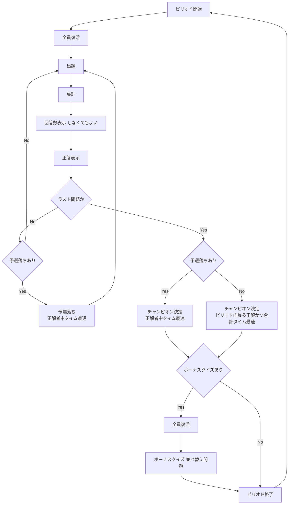

```mermaid
flowchart TD;
    A[ピリオド開始] --> B[全員復活]
    B --> C[出題]
    C --> D[集計]
    D --> E[回答数表示 しなくてもよい]
    E --> F[正答表示]
    F --> G{ラスト問題か}

    G -- No --> H{予選落ちあり}
    H -- Yes --> I[予選落ち<br>正解者中タイム最遅]
    I --> C
    H -- No --> C

    G -- Yes --> J{予選落ちあり}
    J -- Yes --> K[チャンピオン決定<br>正解者中タイム最速]
    J -- No --> L[チャンピオン決定<br>ピリオド内最多正解かつ合計タイム最速]

    K --> M{ボーナスクイズあり}
    L --> M

    M -- Yes --> N[全員復活]
    N --> O[ボーナスクイズ 並べ替え問題]
    O --> P[ピリオド終了]
    
    M -- No --> P
    P --> A
```