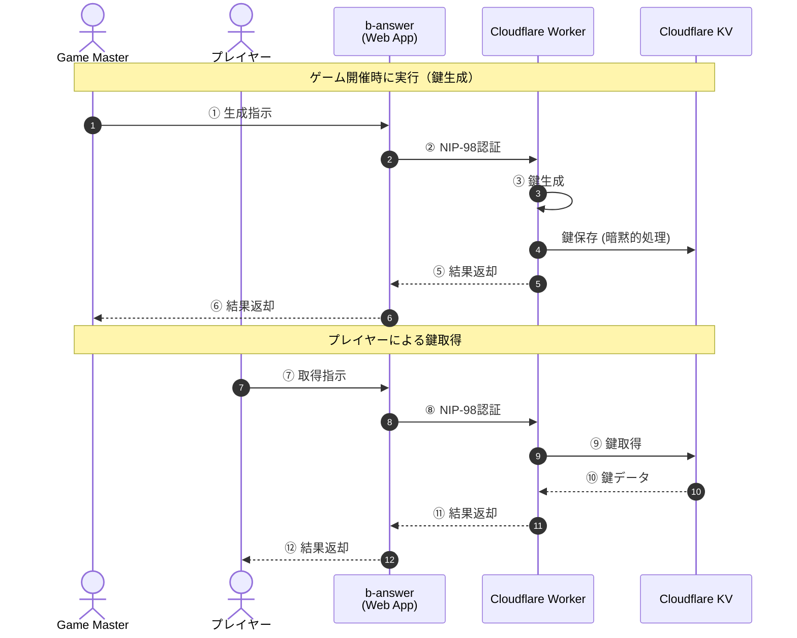

```mermaid
sequenceDiagram;
    autonumber
    actor GM as Game Master
    actor Player as プレイヤー
    participant Web as b-answer<br>(Web App)
    participant Worker as Cloudflare Worker
    participant KV as Cloudflare KV

    %% 鍵生成フェーズ
    note over GM, KV: ゲーム開催時に実行（鍵生成）

    GM->>Web: ① 生成指示
    Web->>Worker: ② NIP-98認証
    Worker->>Worker: ③ 鍵生成
    Worker->>KV: 鍵保存 (暗黙的処理)
    Worker-->>Web: ⑤ 結果返却
    Web-->>GM: ⑥ 結果返却

    %% 鍵取得フェーズ
    note over GM, KV: プレイヤーによる鍵取得

    Player->>Web: ⑦ 取得指示
    Web->>Worker: ⑧ NIP-98認証
    Worker->>KV: ⑨ 鍵取得
    KV-->>Worker: ⑩ 鍵データ
    Worker-->>Web: ⑪ 結果返却
    Web-->>Player: ⑫ 結果返却
```