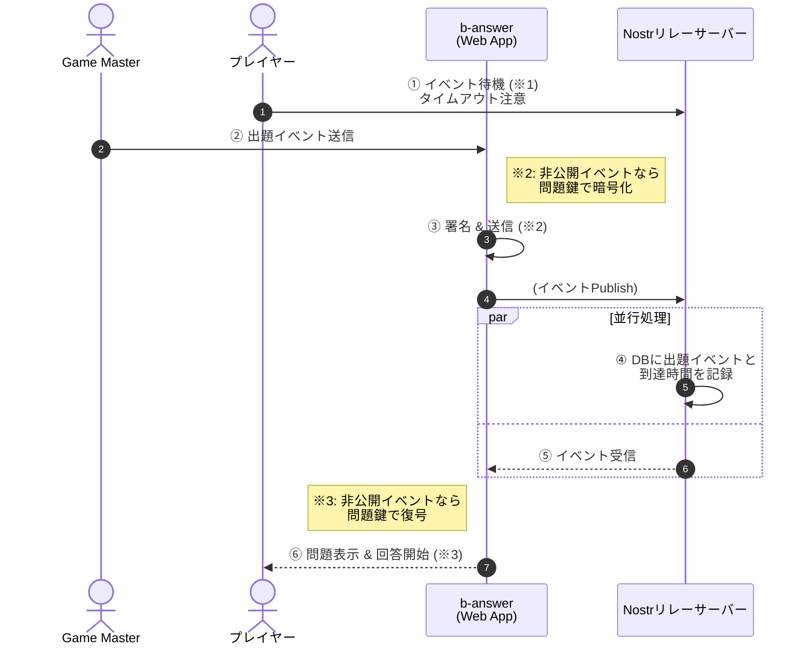

```mermaid
sequenceDiagram;
    autonumber
    actor GM as Game Master
    actor Player as プレイヤー
    participant Web as b-answer<br>(Web App)
    participant Relay as Nostrリレーサーバー

    Player->>Relay: ① イベント待機 (※1)<br>タイムアウト注意
    GM->>Web: ② 出題イベント送信
    
    Note right of Web: ※2: 非公開イベントなら<br>問題鍵で暗号化
    Web->>Web: ③ 署名 & 送信 (※2)
    Web->>Relay: (イベントPublish)
    
    par 並行処理
        Relay->>Relay: ④ DBに出題イベントと<br>到達時間を記録
    and
        Relay-->>Web: ⑤ イベント受信
    end

    Note left of Web: ※3: 非公開イベントなら<br>問題鍵で復号
    Web-->>Player: ⑥ 問題表示 & 回答開始 (※3)
```