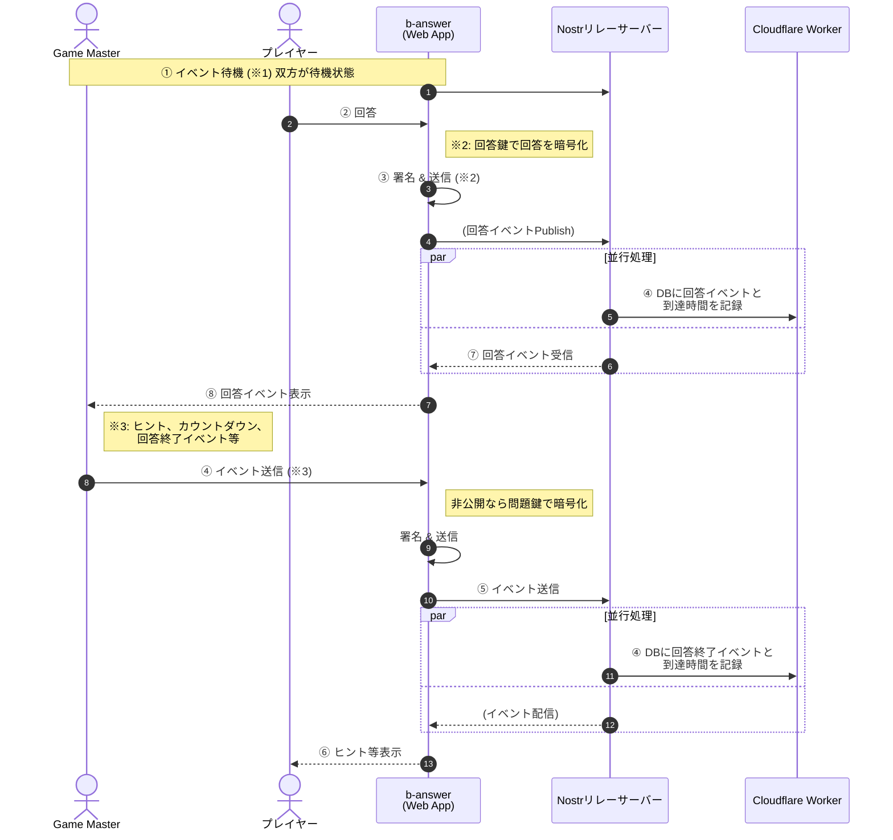

```mermaid
sequenceDiagram;
    autonumber
    actor GM as Game Master
    actor Player as プレイヤー
    participant Web as b-answer<br>(Web App)
    participant Relay as Nostrリレーサーバー
    participant Worker as Cloudflare Worker

    Note over GM, Web: ① イベント待機 (※1) 双方が待機状態
    Web->>Relay: 

    %% プレイヤーの回答フロー
    Player->>Web: ② 回答
    
    Note right of Web: ※2: 回答鍵で回答を暗号化
    Web->>Web: ③ 署名 & 送信 (※2)
    Web->>Relay: (回答イベントPublish)

    par 並行処理
        Relay->>Worker: ④ DBに回答イベントと<br>到達時間を記録
    and
        Relay-->>Web: ⑦ 回答イベント受信
    end
    
    Web-->>GM: ⑧ 回答イベント表示

    %% GMのヒント/終了フロー
    Note right of GM: ※3: ヒント、カウントダウン、<br>回答終了イベント等
    GM->>Web: ④ イベント送信 (※3)

    Note right of Web: 非公開なら問題鍵で暗号化
    Web->>Web: 署名 & 送信
    Web->>Relay: ⑤ イベント送信
    par 並行処理
        Relay->>Worker: ④ DBに回答終了イベントと<br>到達時間を記録
    and
        Relay-->>Web: (イベント配信)
    end

    Web-->>Player: ⑥ ヒント等表示
```