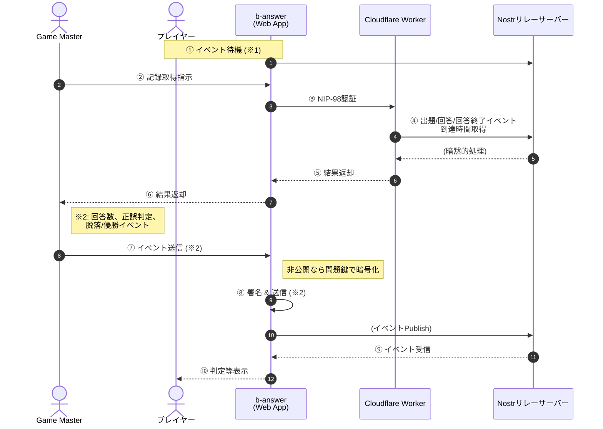

```mermaid
sequenceDiagram;
    autonumber
    actor GM as Game Master
    actor Player as プレイヤー
    participant Web as b-answer<br>(Web App)
    participant Worker as Cloudflare Worker
    participant Relay as Nostrリレーサーバー

    Note over Player, Web: ① イベント待機 (※1)
    Web->>Relay: 

    GM->>Web: ② 記録取得指示
    Web->>Worker: ③ NIP-98認証
    Worker->>Relay: ④ 出題/回答/回答終了イベント<br>到達時間取得
    Relay-->>Worker: (暗黙的処理)
    Worker-->>Web: ⑤ 結果返却
    Web-->>GM: ⑥ 結果返却

    Note right of GM: ※2: 回答数、正誤判定、<br>脱落/優勝イベント
    GM->>Web: ⑦ イベント送信 (※2)

    Note right of Web: 非公開なら問題鍵で暗号化
    Web->>Web: ⑧ 署名 & 送信 (※2)
    Web->>Relay: (イベントPublish)
    Relay-->>Web: ⑨ イベント受信
    Web-->>Player: ⑩ 判定等表示
```